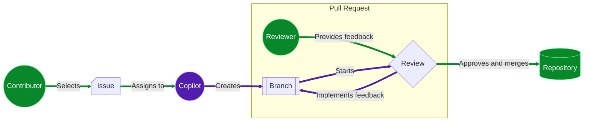

## Passo 1: Habilitar Copilot coding agent

No exercício [Introdução ao GitHub Copilot](/skills/getting-started-with-github-copilot), aprendemos como usar o Copilot em nosso editor de código para fazer grandes atualizações no site de Atividades Extracurriculares da Mergington. 🎻 ⚽️ 

Na verdade, o site se tornou uma ferramenta escolar regular agora. E, embora você goste dessa atenção, você acabou de perceber um problema! Você está prestes a entrar em sabático no próximo semestre!

Após alguma discussão com o diretor, ele aceitou que novas funcionalidades serão adiadas, mas... ele está preocupado. Eles precisam pelo menos ter _algo_ para lidar com mudanças simples enquanto você estiver fora.

Vamos preparar nossos professores para o sucesso inscrevendo o Copilot (em nossa escola) para lidar com updates enquanto estivermos fora.


### O Copilot agora é seu coding agent!

Em exercícios anteriores, usamos o Copilot **chat**, **edits** e modo **agent**. Embora esses tenham sido super úteis, o **Copilot coding agent** leva isso para o próximo nível operando inteiramente no GitHub. Nenhum editor de código necessário! 😎

| Feature           | Copilot no editor             | Copilot coding agent         |
| ----------------- | ----------------------------- | ---------------------------- |
| **Interface**     | Seu editor de código          | Issues e Pull Requests       |
| **Work Scope**    | Arquivos locais               | Repository                   |
| **Activation**    | Sugestões inline, chat        | Atribuição de issue          |
| **Customization** | Instruções customizadas       | Instruções customizadas      |
| **MCP Support**   | Sim                           | Sim                          |
| **Vibe Coding**   | 😎                            | 😎                           |

### Como funciona?

Da perspectiva do contributor, o fluxo é muito similar a um workflow normal.

1. Um contributor com **write access** seleciona uma issue e a atribui ao Copilot (em vez de a si mesmo).
2. O Copilot cria um branch e pull request.
3. O Copilot trabalha no branch em um workflow do Actions e fornece updates via aba de conversação do pull request.
4. Quando o Copilot termina a issue, é solicitado ao atribuidor que faça review.
5. O atribuidor submete um review, adiciona comentários ou aprova.
6. Se feedback for fornecido, o Copilot continua trabalhando para implementá-lo.
7. O solicitante repete os steps acima até ficar satisfeito e então faz merge.



### Isso é seguro?

Várias precauções de segurança foram implementadas para ajudar a reduzir preocupações. Aqui estão algumas limitações que você pode precisar considerar ao pedir ao Copilot para trabalhar em uma issue.

- O Copilot só pode fazer mudanças no branch que criou e resources fornecidos pelo repository.
- O Copilot tem [firewall configurável](https://docs.github.com/en/enterprise-cloud@latest/early-access/copilot/coding-agent/customizing-copilot-coding-agents-development-environment#customizing-or-disabling-the-agents-firewall) que restringe o acesso à internet.
- Apenas usuários com write access podem atribuir uma issue ao Copilot.
- Conteúdo oculto em issues (como código comentado) é ignorado.

> [!IMPORTANT]
> A lista completa de mitigations e configurações pode ser encontrada na documentação [Riscos & Mitigações](https://docs.github.com/en/enterprise-cloud@latest/early-access/copilot/coding-agent/using-copilot-coding-agent#copilot-coding-agent-risks-and-mitigations).

## ⌨️ Atividade: (opcional) Conheça nosso site de atividades extracurriculares

> [!NOTE]
> Abrir um ambiente de desenvolvimento e executar a aplicação não é necessário para completar este exercício. Você pode pular esta atividade se desejar.

<details>
<summary>Mostrar Passos</summary>

Em outros exercícios, temos desenvolvido o website de Atividades Extracurriculares. Você pode seguir estes passos para iniciar o ambiente de desenvolvimento e experimentá-lo.

1. Clique com o botão direito no botão abaixo para abrir a página **Create Codespace** em uma nova aba. Use a configuração padrão.

   [](https://codespaces.new/{{full_repo_name}}?quickstart=1)

1. Aguarde algum tempo para o ambiente ser preparado. Ele instalará automaticamente todos os requirements e services.

1. Valide se as extensions **GitHub Copilot** e **Python** estão instaladas e habilitadas.

   <br/>
   

1. Tente executar a aplicação. Na sidebar esquerda, selecione a aba **Run and Debug** e então pressione o ícone **Start Debugging**.

   <details>
   <summary>📸 Mostrar screenshot</summary><br/>

   

   </details>

   <details>
   <summary>🤷 Tendo problemas?</summary><br/>

   Se a área **Run and Debug** estiver vazia, tente recarregar o VS Code: Abra a command palette (`Ctrl`+`Shift`+`P`) e busque por `Developer: Reload Window`.

   

   </details>

1. Use a aba **Ports** para encontrar o endereço da webpage, abri-lo e verificar se está funcionando.

   <details>
   <summary>📸 Show screenshot</summary><br/>

   

   </details>

</details>

## ⌨️ Atividade: Habilitar Copilot coding agent no seu repository

Antes de podermos começar a delegar requests dos professores para o Copilot, precisamos conceder acesso ao nosso repository.

1. No canto superior direito, clique no seu **ícone de usuário** e selecione **Settings**.

   <br/>
   

1. Na navegação esquerda, expanda a seção **Copilot** e selecione **Coding agent**.

   

1. Mude o campo **Repository access** para `Only selected repositories`.

   

1. Clique no botão **Select repositories** e certifique-se de que este exercício esteja selecionado.

   

## ⌨️ Atividade: Atribuir uma issue ao Copilot

Há várias issues importantes para resolver antes de partirmos, mas vamos fazer um teste primeiro com uma das opções simples. Isso nos permitirá ver como as interações e colaboração funcionam, para que possamos atualizar nossos docs para orientar os outros professores. A maioria não sabe como usar um editor de código tradicional!

> [!TIP]
> Tente deixar claro o objetivo e critérios de aceitação de uma issue. Além disso, dividir tarefas grandes em menores oferece mais oportunidade para feedback!

1. Retorne ao seu [repository do exercício](<(https://github.com/{{full_repo_name}})>).

1. Na navegação superior, selecione a aba **Issues**.

1. Acima da lista, no canto superior direito, clique no botão **New Issue**.

1. Defina o **Title** como:

   ```md
   Missing Activity: Manga Maniacs
   ```

   Digite o texto abaixo como descrição, e clique no botão **Create**.

   ```md
   O clube de mangá foi anunciado recentemente e naturalmente está faltando no website. Por favor, adicione-o.

   Aqui estão os detalhes:

   Descrição: Explore as histórias fantásticas dos personagens mais interessantes dos Mangás japoneses (graphic novels).

   Horário: Terças às 19h
   Lotação máxima: 15 pessoas
   ```

1. No canto superior direito, clique na área **Assignees** e selecione **Copilot**.

   

1. Na parte inferior, clique no botão **Create**. Após um momento, você notará:

   - A issue terá uma reaction `👀` para mostrar que o Copilot está lendo a issue.
   - O log de atividade mostra que você atribuiu a issue ao Copilot.
   - O log da issue inclui um pull request vinculado.

   

1. Com a issue atribuída, a Mona deve estar ocupada verificando seu trabalho. Dê a ela um momento para compartilhar os próximos steps.

<details>
   <summary>Tendo problemas? 🤷</summary><br/>

Se você não receber feedback, aqui estão algumas coisas para verificar:

- Certifique-se de que atribuiu a issue correta. Se você praticar em outras issues, elas serão ignoradas.

</details>
